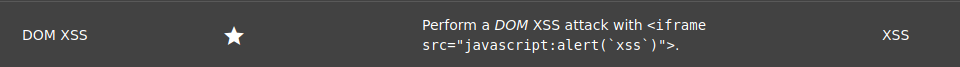

# CEH-owasp-dom-xss

## juice-shop score-board challenge



## pwning juice-shop

[https://pwning.owasp-juice.shop/part2/xss.html#perform-a-dom-xss-attack](https://pwning.owasp-juice.shop/part2/xss.html#perform-a-dom-xss-attack)

## source code

search-result.component.html
```
<div *ngIf="searchValue">
  <span>{{"TITLE_SEARCH_RESULTS" | translate}} - </span>
  <span id="searchValue" [innerHTML]="searchValue"></span>
</div>
```
[https://www.stackhawk.com/blog/angular-xss-guide-examples-and-prevention/](https://www.stackhawk.com/blog/angular-xss-guide-examples-and-prevention/) 
> Imagine your website needs an input field that allows HTML formatting, such as a comment box. In such situations, you can use Angular's `innerHtml` property to bind the user input. Note that this is different from the innerHTML in the native web APIs. Angular has automatically recognized the `<script>` tag as unsafe and removed it, but has kept the `<b>` tag as it's potentially safe. This modification in Angular is called sanitization.
> The above examples show that Angular has built-in security capabilities to protect your application from XSS attacks. Therefore, if you need to use a validated user input within the application, you'll need to mark the input as trusted. For this purpose, you can make use of the `DomSanitizer` and use the `byPassSecurityTrust..()` functions to tell Angular that you trust the input value. However, you must be extremely cautious when using this functionality, as XSS attacks are possible if your input gets tampered with. This step should only be done when your inputs are trustworthy, and you must check all execution paths to make sure the application is secured.

## sonar security issue


## exploit

query for `<iframe src="javascript:alert(``xss``)">`

[http://localhost:3000/#/search?q=%3Ciframe%20src%3D%22javascript:alert(%60xss%60)%22%3E](http://localhost:3000/#/search?q=%3Ciframe%20src%3D%22javascript:alert(%60xss%60)%22%3E)

## fix 1

Not using `bypassSecurityTrustHtml`.

search-result.component.ts
```
//this.searchValue = this.sanitizer.bypassSecurityTrustHtml(queryParam)
this.searchValue = queryParam
```

## fix 2

Interpolation. [https://angular.io/guide/security#xss](https://angular.io/guide/security#xss)
> Interpolated content is always escaped. The HTML isn't interpreted and the browser displays angle brackets in the element's text content.

search-result.component.html
```
<div *ngIf="searchValue">
  <span>{{"TITLE_SEARCH_RESULTS" | translate}} - </span>
  <span id="searchValue">{{ searchValue }}</span>
</div>
```

test